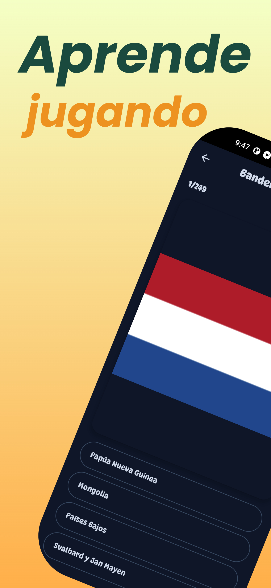
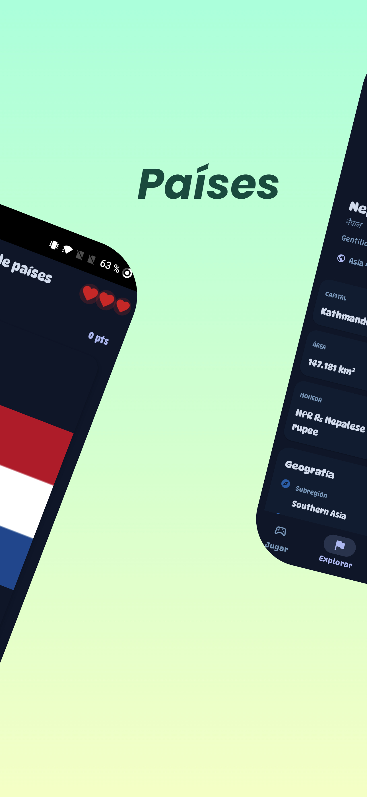
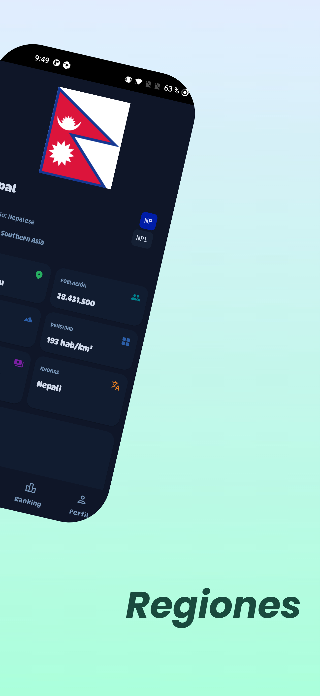
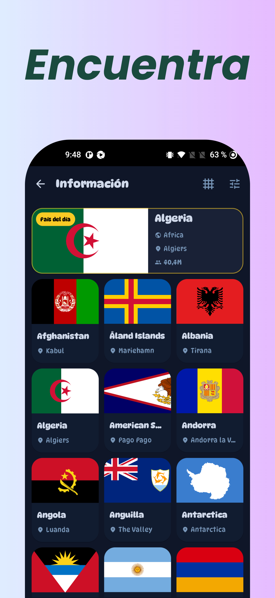
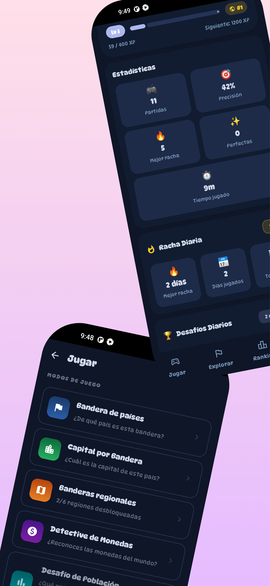
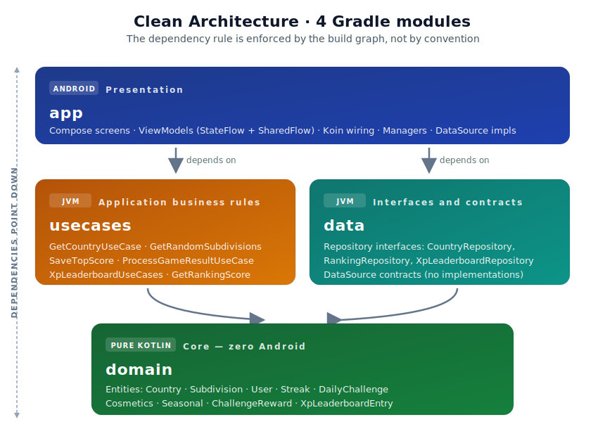
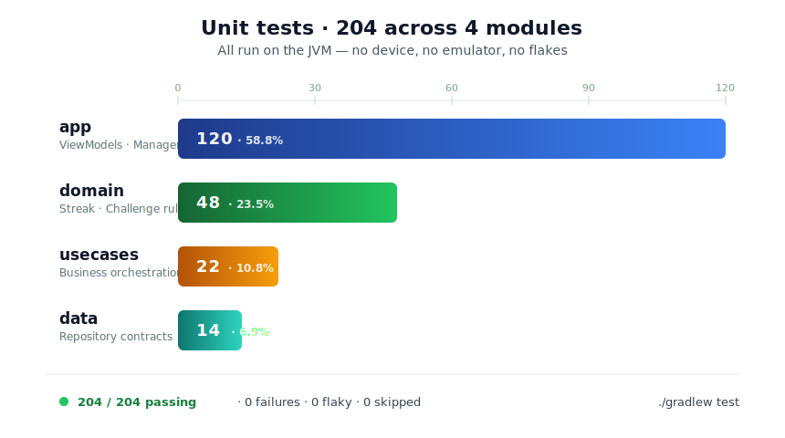

# AdivinaBandera

[](https://github.com/AlvaroQ/AdivinaBandera/actions/workflows/ci.yml)
[](https://play.google.com/store/apps/details?id=com.alvaroquintana.adivinabandera)


[](LICENSE)

---

## Table of Contents

[About](#about) · [Screenshots](#screenshots) · [Game Modes](#game-modes) · [Tech Stack](#tech-stack) · [Architecture](#architecture) · [Features](#features) · [Design decisions](#design-decisions) · [Testing](#testing) · [Getting Started](#getting-started) · [Links](#links) · [License](#license)

---

## About

AdivinaBandera is an Android quiz game about **world flags, capitals, currencies, populations and regional symbols**. It started as a small hobby app and has grown into a 200+ country catalogue with 11 game modes, a progression system, a cosmetics economy and daily challenges — built with modern Kotlin, Jetpack Compose and Clean Architecture.

It is also a long-lived production codebase that doubles as a real-world reference for modular Android architecture, Koin dependency injection, Firebase-backed leaderboards and a fully offline-first data layer powered by Room.

---

## Screenshots

<table align="center">
  <tr>
    <td align="center"><br/><sub>Game mode selection</sub></td>
    <td align="center"><br/><sub>Flag question in play</sub></td>
    <td align="center"><br/><sub>Capital by flag</sub></td>
  </tr>
  <tr>
    <td align="center"><br/><sub>Result & XP earned</sub></td>
    <td align="center"><br/><sub>Global ranking</sub></td>
  </tr>
</table>

---

## Game Modes

Eleven progressively-unlocked modes keep sessions varied beyond "guess the flag":

| Mode                    | Unlock        | What you guess                                                    |
| ----------------------- | ------------- | ----------------------------------------------------------------- |
| **Classic**             | Level 1       | Country from its flag                                             |
| **Capital by flag**     | Level 1       | Capital city from the flag                                        |
| **Currency Detective**  | Level 5       | Country from its currency                                         |
| **Population Challenge**| Level 10      | Higher-population country between two options                     |
| **World Mix**           | Level 15      | Random mix of 7 question types (language, demonym, neighbours...) |
| **Regional — Spain**    | Always        | Autonomous communities by flag                                    |
| **Regional — Mexico**   | 6 correct ES  | Mexican states by flag                                            |
| **Regional — Argentina**| 6 correct MX  | Argentine provinces by flag                                       |
| **Regional — Brazil**   | 6 correct AR  | Brazilian states by flag                                          |
| **Regional — Germany**  | 6 correct BR  | German federal states by flag                                     |
| **Regional — USA**      | 6 correct DE  | US states by flag                                                 |

Each mode keeps its own Firestore leaderboard (top 20) and contributes independently to XP and daily challenge progress.

---

## Tech Stack

| Category               | Technology                                                      | Version           |
| ---------------------- | --------------------------------------------------------------- | ----------------- |
| Language               | Kotlin                                                          | 2.3.20            |
| Build                  | Android Gradle Plugin                                           | 9.1.1             |
| UI                     | Jetpack Compose + Material3                                     | BOM 2026.03.01    |
| Architecture           | Clean Architecture — 4 Gradle modules                           | MVI (pragmatic)   |
| State Management       | StateFlow + SharedFlow + sealed `Intent` / `Event`              | Coroutines 1.10.2 |
| Navigation             | Navigation Compose (type-safe, kotlinx.serialization)           | 2.9.7             |
| Dependency Injection   | Metro (compile-time, Kotlin compiler plugin)                    | 0.10.3            |
| Local Persistence      | Room (KSP) + DataStore Preferences                              | 2.8.4 / 1.2.1     |
| Background work        | WorkManager (daily reminders)                                   | 2.11.2            |
| Backend                | Firebase (Firestore, Realtime DB, Auth, Analytics, Crashlytics) | BOM 34.12.0       |
| Images                 | Coil Compose (+ SVG decoder)                                    | 3.4.0             |
| Serialization          | kotlinx.serialization                                           | 1.11.0            |
| Monetization           | AdMob (banner + rewarded) with UMP consent                      | 25.2.0 / 4.0.0    |
| Min SDK                | Android 6.0 (Marshmallow)                                       | API 23            |
| Compile / Target SDK   | Android 15                                                      | API 36            |

---

## Architecture

<p align="center">
  
</p>

Four Gradle modules, one responsibility each:

- **`app`** — Android layer: Compose screens, ViewModels, Metro `AppGraph` (with `@Provides` for Firebase/Room/DataStore), DataSource implementations, notification scheduling.
- **`usecases`** — Pure-JVM orchestration (`GetCountryUseCase`, `ProcessGameResultUseCase`, `XpLeaderboardUseCases`...).
- **`data`** — Repository and DataSource **interfaces**. No implementations — those live in `app` so the Android SDK stays out of `data`.
- **`domain`** — Pure Kotlin entities: `Country`, `Subdivision`, `Streak`, `DailyChallenge`, `PlayerCosmetics`, `XpLeaderboardEntry`. Zero Android imports.

The dependency rule is enforced by the Gradle graph itself: if `domain` tried to import anything Android, Gradle wouldn't compile it. Every screen ViewModel extends a shared `MviViewModel<S, I, E>` base and exposes three primitives: `state: StateFlow<UiState>`, `events: SharedFlow<UiEvent>` (navigation, toasts, dialog requests) and `dispatch(intent: I)` as the single UI entry point. Metro generates the dependency graph at compile time — `@DependencyGraph(AppScope::class) interface AppGraph` is the root, populated by `@ContributesBinding` and `@Inject` annotations across all four modules. Missing or cyclic bindings fail the build, not the runtime.

---

## Features

- **Gameplay** — 11 level-gated modes, extra-lives system (up to 3 per game), in-game streak counter with motivational messages.
- **Progression** — 50 XP levels up to 393k XP with dynamic titles, daily streaks with freeze tokens, 3 deterministic daily challenges per user/date, 20+ achievements.
- **Economy & cosmetics** — dual currency (*coins* + *gems*), 17 unlockable cosmetics across 5 categories, Mystery Box every 10 games, per-country mastery tracking.
- **Content & data** — 200+ countries (capital, currency, language, demonym, borders, population…), regional subdivisions for 6 countries, offline-first once Room is seeded from Firebase.
- **Platform** — Material3 light/dark themes, ES/EN localization, AdMob banner + rewarded with UMP consent, daily reminders via WorkManager.

---

## Design decisions

Short rationale behind the less-obvious architectural choices — what was gained, what was given up.

- **Room as source of truth, Firebase as the seed.** Country data syncs once from Firebase Realtime Database into Room; every subsequent query hits SQLite. Fully playable offline, predictable latency, and random-draw queries don't burn Firestore reads. *Tradeoff:* new content isn't real-time — acceptable for a dataset that changes on the order of weeks.
- **XP is local, leaderboards are public.** XP, coins, gems, streaks, achievements and cosmetics live in DataStore on-device. The only data that leaves the device is an anonymous top-20 leaderboard entry per mode in Firestore. GDPR-simple, Firestore cost is bounded, no account-recovery surface. *Tradeoff:* reinstalling loses progress — accepted for a free, short-session game.
- **Deterministic daily challenges.** The 3 daily challenges derive from a hash of `installId + date`, not a random roll. Stable across restarts, consistent across the same user's devices, no server source of truth needed. *Tradeoff:* predictable to a datamining player — fine given the catalogue size.
- **MVI, pragmatic flavour.** Every ViewModel extends a shared `MviViewModel<S, I, E>` base, with one immutable `UiState`, a sealed `Intent` per screen, a sealed `Event` for one-shots, and a single `dispatch(intent: I)` entry point. Screens never call mutator methods on the VM — they only `state.collectAsStateWithLifecycle()` and `dispatch`. *Why pragmatic and not canonical:* the base does **not** force a pure `reduce(state, intent) -> state` — state updates and side effects (use case calls, coroutines) often share a transaction, and a strict reducer/effect split would only add boilerplate for screens that don't need replay or time-travel debugging. The base offers `updateState { copy(...) }` and `emit(Event.X)` inside a single `handleIntent` block. *Trade-off the previous MVVM code had to give up:* there is now ceremony around screens whose state is genuinely orthogonal (e.g. `GameViewModel` had 8 granular flows that turn into a single `GameUiState`) — the win is one snapshot per screen for tests, screenshots, and Compose state-restoration.
- **Metro for compile-time DI.** Metro is a Kotlin compiler plugin (FIR + IR) that builds the dependency graph at compile time — closer to Dagger's runtime model but without `kapt` or `ksp` in the DI path. The whole graph is one `@DependencyGraph(AppScope::class) interface AppGraph` populated by `@ContributesBinding` aggregation. Missing or cyclic bindings **fail the build, not the runtime** — this was the main thing the previous Koin setup gave up. Aggregation across the four modules is automatic, so adding a new use case or repository implementation only requires `@Inject` on the constructor; no central registry edit. *Tradeoff:* a compiler plugin tied to a specific Kotlin version (Metro 0.10.x ↔ Kotlin 2.3.x) — every Kotlin bump now needs a matching Metro bump. Metro's `metrox-android` helper artifact is **deliberately not used** because it declares minSdk 28; the `AppGraph` is bootstrapped manually via `createGraphFactory<AppGraph.Factory>().create(this)` in `AdivinaApp.onCreate()`.
- **Progressive mode unlocks.** Levels 5/10/15 gate advanced modes; the regional chain requires 6 correct answers in the previous country. Pure retention design — no overwhelming tile wall on day one. *Tradeoff:* seasoned players returning after an update re-earn modes — acceptable because unlocks happen within the first sessions.

---

## Testing

<p align="center">
  
</p>

All tests run on the JVM — no device, no emulator. Every push and pull request to `main` runs the full suite through [GitHub Actions](.github/workflows/ci.yml).

| Module     | Tests | What's covered                                                                          |
| ---------- | ----- | --------------------------------------------------------------------------------------- |
| `app`      | 124   | ViewModels (`GameViewModel`, `ResultViewModel`, `RankingViewModel`, `InfoViewModel`), `ProgressionManager`, `ChallengeAppConfig`, `BanderaCatalog`, `DataBaseSourceImpl` subdivisions |
| `domain`   | 48    | `StreakRules` (37 tests — streak progression and freeze-token logic), `ChallengeReward` payout math |
| `usecases` | 44    | `GetCountryUseCase`, `GetRandomSubdivisions`, `GetRankingScore`, `GetRecordScore`, `SaveTopScore`, `ProcessGameResultUseCase`, `RecordAnswerUseCase` |
| `data`     | 14    | `CountryRepository`, `RankingRepository` contracts                                      |
| **Total**  | **230** | **0 failures · 0 flaky · 0 skipped**                                                  |

Stack:

- **JUnit 4** for the test harness
- **MockK 1.14.9** for mocking coroutine APIs and Firebase boundaries
- **Turbine 1.2.1** for asserting `Flow` emissions
- **kotlinx.coroutines.test** for `runTest` and `TestDispatcher`
- **MainDispatcherRule** (custom, in `app/src/test/`) to swap `Dispatchers.Main` during tests

Run the full suite locally:

```bash
./gradlew test
```

Run a single module:

```bash
./gradlew :domain:test
./gradlew :usecases:test
```

---

## Getting Started

### Prerequisites

- **JDK 17+** (required by Android Gradle Plugin 9.x)
- **Android Studio Ladybug (2024.2)** or newer
- **Android SDK 36** installed via SDK Manager
- A Firebase project with `google-services.json` (Firestore, Realtime Database, Auth, Analytics and Crashlytics enabled)
- An AdMob account for ad unit IDs (test IDs work out of the box for debug builds)

### Setup

1. Clone the repository:

   ```bash
   git clone https://github.com/AlvaroQ/AdivinaBandera.git
   ```

2. Drop your `google-services.json` in `app/`.

3. Create `app/secrets/secrets.xml` with your AdMob keys. The structure expected by `app/build.gradle` is:

   ```xml
   <?xml version="1.0" encoding="utf-8"?>
   <resources>
       <string name="admob_id">ca-app-pub-XXXXXXXXXXXXXXXX~XXXXXXXXXX</string>
       <string name="admob_banner_test_id">ca-app-pub-XXXXXXXXXXXXXXXX/XXXXXXXXXX</string>
       <string name="admob_bonificado_test_id">ca-app-pub-XXXXXXXXXXXXXXXX/XXXXXXXXXX</string>
       <string name="admob_banner_game">ca-app-pub-XXXXXXXXXXXXXXXX/XXXXXXXXXX</string>
       <string name="admob_banner_ranking">ca-app-pub-XXXXXXXXXXXXXXXX/XXXXXXXXXX</string>
       <string name="admob_bonificado_game">ca-app-pub-XXXXXXXXXXXXXXXX/XXXXXXXXXX</string>
   </resources>
   ```

   For a first build, Google publishes a set of always-on [AdMob test ad unit IDs](https://developers.google.com/admob/android/test-ads) that you can drop into the `*_test_id` entries. Replace them with your own production IDs before shipping a release build.

4. Build the debug APK:

   ```bash
   ./gradlew assembleDebug
   ```

5. (Optional) Run the unit tests:

   ```bash
   ./gradlew test
   ```

---

## Links

- [Play Store listing](https://play.google.com/store/apps/details?id=com.alvaroquintana.adivinabandera) — install AdivinaBandera on your device
- [Report a bug](https://github.com/AlvaroQ/AdivinaBandera/issues/new?labels=bug) — something broken or unexpected
- [Request a feature](https://github.com/AlvaroQ/AdivinaBandera/issues/new?labels=enhancement) — propose an improvement
- [CI workflows](https://github.com/AlvaroQ/AdivinaBandera/actions) — latest build and test runs

---

## License

Released under the [Apache License 2.0](LICENSE). You are free to use, modify, and distribute the code with attribution.
